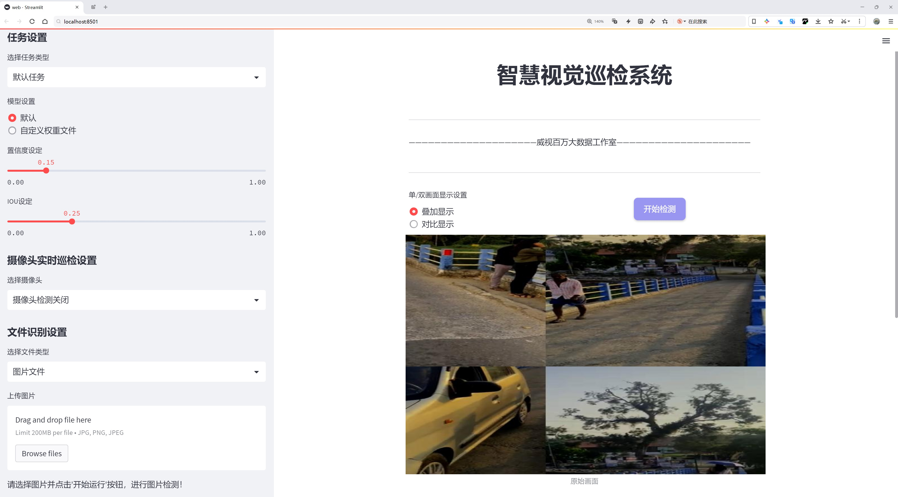
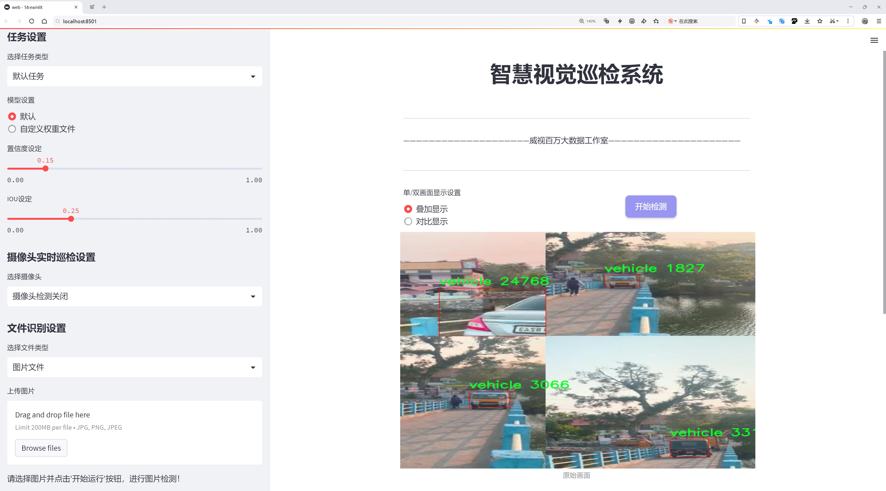
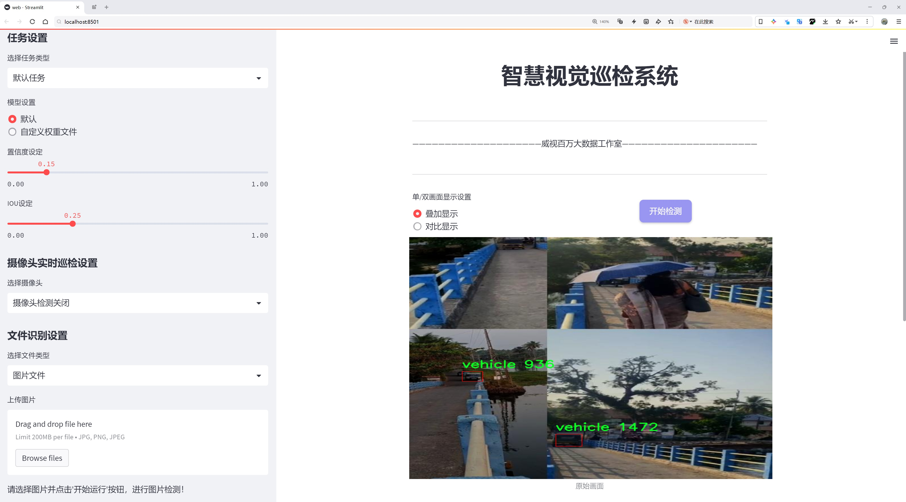
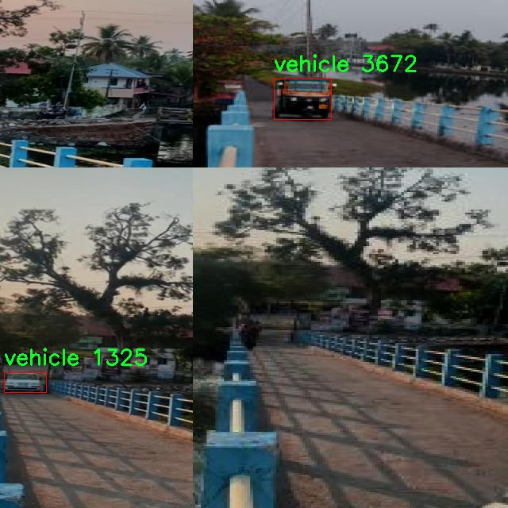
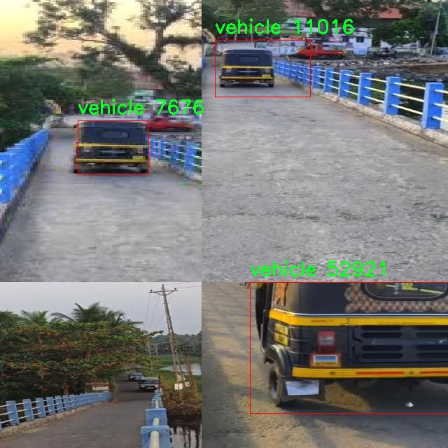
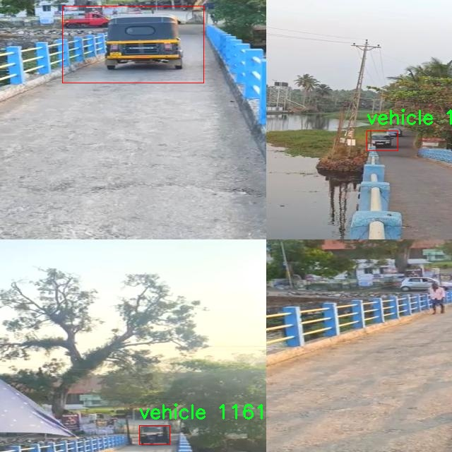
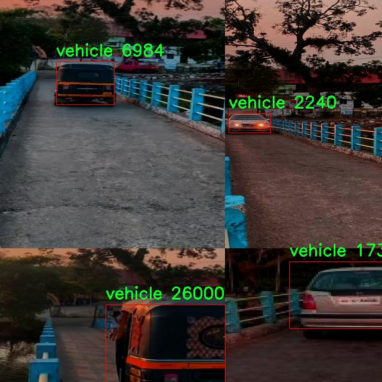

# 车辆检测检测系统源码分享
 # [一条龙教学YOLOV8标注好的数据集一键训练_70+全套改进创新点发刊_Web前端展示]

### 1.研究背景与意义

项目参考[AAAI Association for the Advancement of Artificial Intelligence](https://gitee.com/qunmasj/projects)

项目来源[AACV Association for the Advancement of Computer Vision](https://kdocs.cn/l/cszuIiCKVNis)

研究背景与意义

随着城市化进程的加快和机动车保有量的不断增加，交通管理与安全问题日益突出。车辆检测作为智能交通系统中的核心技术之一，直接影响到交通流量监测、交通事故预警、停车管理等多个方面。传统的车辆检测方法多依赖于人工监控和简单的图像处理技术，效率低下且容易受到环境因素的影响。近年来，深度学习技术的迅猛发展为车辆检测提供了新的解决方案，其中YOLO（You Only Look Once）系列模型因其高效的实时检测能力而备受关注。YOLOv8作为该系列的最新版本，具备更强的特征提取能力和更快的推理速度，适合在复杂的交通环境中进行车辆检测。

本研究旨在基于改进的YOLOv8模型，构建一个高效的车辆检测系统，以应对日益严峻的交通管理挑战。我们使用的数据集包含9600张图像，专注于单一类别的车辆检测，这为模型的训练和评估提供了丰富的样本基础。通过对数据集的深入分析和处理，我们将优化数据预处理流程，以提高模型的训练效果和检测精度。数据集的规模和多样性将为模型的泛化能力提供良好的支持，使其能够在不同的交通场景中保持高效的检测性能。

改进YOLOv8模型的研究不仅具有理论意义，也具备重要的实际应用价值。首先，优化后的模型能够在实时交通监控系统中发挥重要作用，帮助交通管理部门及时获取交通流量信息，进行动态调度和管理，从而提高道路通行效率，减少交通拥堵。其次，车辆检测系统的准确性和实时性对于智能停车管理、自动驾驶技术的实现具有重要影响。通过高效的车辆检测，能够为自动驾驶系统提供精准的环境感知能力，进而提升自动驾驶的安全性和可靠性。

此外，随着智能城市和智慧交通的不断发展，车辆检测技术的应用场景也在不断扩展。例如，在智能交通信号控制系统中，车辆检测可以为信号灯的智能调控提供依据，进而优化交通流量。在交通事故监测与分析中，准确的车辆检测能够为事故责任判定提供重要证据。因此，基于改进YOLOv8的车辆检测系统不仅是对现有技术的提升，更是对未来智能交通系统发展的积极推动。

综上所述，本研究的开展将为车辆检测技术的发展提供新的思路和方法，推动智能交通系统的进步。通过深入探讨YOLOv8模型的改进与应用，我们期望能够为交通管理、智能驾驶等领域带来更高效、更智能的解决方案，最终实现交通安全与管理的优化。

### 2.图片演示







##### 注意：由于此博客编辑较早，上面“2.图片演示”和“3.视频演示”展示的系统图片或者视频可能为老版本，新版本在老版本的基础上升级如下：（实际效果以升级的新版本为准）

  （1）适配了YOLOV8的“目标检测”模型和“实例分割”模型，通过加载相应的权重（.pt）文件即可自适应加载模型。

  （2）支持“图片识别”、“视频识别”、“摄像头实时识别”三种识别模式。

  （3）支持“图片识别”、“视频识别”、“摄像头实时识别”三种识别结果保存导出，解决手动导出（容易卡顿出现爆内存）存在的问题，识别完自动保存结果并导出到tempDir中。

  （4）支持Web前端系统中的标题、背景图等自定义修改，后面提供修改教程。

  另外本项目提供训练的数据集和训练教程,暂不提供权重文件（best.pt）,需要您按照教程进行训练后实现图片演示和Web前端界面演示的效果。

### 3.视频演示

[3.1 视频演示](https://www.bilibili.com/video/BV1hosbe9EaV/)

### 4.数据集信息展示

##### 4.1 本项目数据集详细数据（类别数＆类别名）

nc: 1
names: ['vehicle']


##### 4.2 本项目数据集信息介绍

数据集信息展示

在本研究中，我们采用了名为“Pulinkunnoo”的数据集，以改进YOLOv8的车辆检测系统。该数据集专注于车辆的检测与识别，旨在为自动驾驶、交通监控及智能交通系统等应用提供高质量的训练数据。Pulinkunnoo数据集的设计充分考虑了现实世界中车辆的多样性和复杂性，确保模型在各种环境下的鲁棒性和准确性。

Pulinkunnoo数据集的类别数量为1，具体类别为“vehicle”。这一单一类别的设置，虽然看似简单，但却为模型的训练提供了清晰的目标，避免了多类别之间的干扰。车辆作为一个重要的研究对象，其检测不仅涉及到传统的汽车，还可能包括摩托车、货车等多种形式的交通工具。通过将所有这些不同类型的车辆统一归为“vehicle”类别，数据集能够更有效地集中资源，提升模型对车辆的识别能力。

数据集的构建过程遵循严格的标准，确保每一张图像都经过精心挑选和标注。Pulinkunnoo数据集包含了大量的图像数据，这些图像在不同的环境条件下拍摄，包括城市街道、高速公路、停车场等多种场景。这种多样化的场景设置使得模型在训练过程中能够接触到各种光照、天气和背景变化，从而增强其适应性和泛化能力。

在数据标注方面，Pulinkunnoo数据集采用了高精度的标注技术，确保每一辆车都被准确框定。标注信息不仅包括车辆的边界框，还可能包含其他相关信息，如车辆的朝向、大小等。这些附加信息为后续的模型训练提供了更为丰富的上下文，有助于提升模型对车辆的检测精度。

此外，Pulinkunnoo数据集还考虑到了数据的平衡性和多样性。通过对不同类型的车辆进行均衡采样，数据集避免了因某一类型车辆数量过多而导致的模型偏倚。这种设计理念确保了模型在实际应用中能够公平地对待各种类型的车辆，提升了检测的全面性和准确性。

在训练过程中，YOLOv8模型将利用Pulinkunnoo数据集进行深度学习，通过反复迭代优化其参数，以实现对车辆的高效检测。数据集的设计和构建为模型提供了坚实的基础，使其能够在实际应用中发挥出色的性能。

总之，Pulinkunnoo数据集为改进YOLOv8的车辆检测系统提供了重要的支持。通过高质量的图像数据和精确的标注信息，该数据集不仅为模型的训练提供了丰富的素材，也为未来的研究和应用奠定了坚实的基础。随着技术的不断进步，我们期待Pulinkunnoo数据集能够在智能交通领域发挥更大的作用，推动车辆检测技术的进一步发展。










### 5.全套项目环境部署视频教程（零基础手把手教学）

[5.1 环境部署教程链接（零基础手把手教学）](https://www.ixigua.com/7404473917358506534?logTag=c807d0cbc21c0ef59de5)


[5.2 安装Python虚拟环境创建和依赖库安装视频教程链接（零基础手把手教学）](https://www.ixigua.com/7404474678003106304?logTag=1f1041108cd1f708b01a)

### 6.手把手YOLOV8训练视频教程（零基础小白有手就能学会）

[6.1 手把手YOLOV8训练视频教程（零基础小白有手就能学会）](https://www.ixigua.com/7404477157818401292?logTag=d31a2dfd1983c9668658)

### 7.70+种全套YOLOV8创新点代码加载调参视频教程（一键加载写好的改进模型的配置文件）

[7.1 70+种全套YOLOV8创新点代码加载调参视频教程（一键加载写好的改进模型的配置文件）](https://www.ixigua.com/7404478314661806627?logTag=29066f8288e3f4eea3a4)

### 8.70+种全套YOLOV8创新点原理讲解（非科班也可以轻松写刊发刊，V10版本正在科研待更新）

由于篇幅限制，每个创新点的具体原理讲解就不一一展开，具体见下列网址中的创新点对应子项目的技术原理博客网址【Blog】：


[8.1 70+种全套YOLOV8创新点原理讲解链接](https://gitee.com/qunmasj/good)

### 9.系统功能展示（检测对象为举例，实际内容以本项目数据集为准）

图9.1.系统支持检测结果表格显示

  图9.2.系统支持置信度和IOU阈值手动调节

  图9.3.系统支持自定义加载权重文件best.pt(需要你通过步骤5中训练获得)

  图9.4.系统支持摄像头实时识别

  图9.5.系统支持图片识别

  图9.6.系统支持视频识别

  图9.7.系统支持识别结果文件自动保存

  图9.8.系统支持Excel导出检测结果数据


### 10.原始YOLOV8算法原理

原始YOLOv8算法原理

YOLOv8作为YOLO系列中的最新版本，继承并发展了前几代模型的设计理念，致力于在目标检测领域实现更高的精度和更快的推理速度。该算法的核心结构可以分为输入端、主干网络、颈部网络和检测头四个主要部分。输入端负责将原始图像进行预处理，通常包括缩放和归一化，以适应模型的输入要求。主干网络则通过一系列卷积操作对图像进行特征提取，利用批归一化和SiLU激活函数来增强模型的非线性表达能力。

在YOLOv8的主干网络中，C2f模块的引入是一个显著的创新。C2f模块结合了YOLOv5中的C3模块和YOLOv7中的ELAN结构，通过增加更多的残差连接，极大地丰富了模型的梯度信息流动。这种设计不仅提升了特征提取的能力，还有效地减轻了模型的计算负担，使得YOLOv8在保持高性能的同时，能够在资源受限的环境中运行。C2f模块的结构设计通过跨层连接来增强梯度流，确保在深层网络中信息的有效传递，从而提升了检测的准确性。

颈部网络采用了PAN-FPN结构，旨在融合来自不同尺度的特征图信息，以便更好地捕捉目标的多样性和复杂性。与传统的上采样卷积结构不同，YOLOv8在这一部分的设计上进行了简化，去掉了多余的卷积层，进一步提升了模型的效率。通过这种特征融合策略，YOLOv8能够在不同的尺度上对目标进行有效的检测，尤其是在小目标和高分辨率图像的处理上表现出色。

YOLOv8的检测头采用了解耦合的结构，这一设计使得分类和回归任务可以独立进行，避免了传统耦合头在处理复杂场景时可能出现的性能瓶颈。通过将Anchor-Based方法替换为Anchor-Free策略，YOLOv8能够更灵活地适应不同的目标形状和大小，减少了对先验框的依赖，进而提升了检测的准确性和鲁棒性。这种解耦合的设计不仅提高了模型的可解释性，还使得在训练过程中可以更加高效地进行样本分配。

在损失函数的设计上，YOLOv8引入了BCELoss作为分类损失，DFLLoss和CIoULoss作为回归损失，这种组合有效地平衡了分类和定位的性能。BCELoss在处理二分类问题时表现出色，而DFLLoss和CIoULoss则在回归任务中提供了更精确的目标框定位。这种多样化的损失函数设计使得YOLOv8在训练过程中能够更好地适应不同的任务需求，从而实现更高的检测精度。

YOLOv8的另一个重要创新是其数据增强策略。在训练过程中，YOLOv8采用了动态Task-Aligned Assigner样本分配策略，并在最后10个epoch中关闭马赛克增强。这种灵活的数据增强策略不仅提高了模型的泛化能力，还减少了训练过程中的过拟合现象，使得模型在面对真实场景时能够表现得更加稳健。

综上所述，YOLOv8通过对主干网络、颈部网络和检测头的创新设计，成功地在目标检测领域实现了性能的全面提升。其轻量化的结构和高效的特征提取能力，使得YOLOv8在处理复杂场景时依然能够保持较高的准确性和实时性。此外，YOLOv8的解耦合检测头和多样化的损失函数设计，使得模型在不同任务上的适应性和灵活性得到了显著增强。这些创新使得YOLOv8不仅在学术研究中占据了重要地位，也在实际应用中展现出广泛的前景。随着YOLOv8的推广和应用，目标检测技术的边界将不断被拓展，为各类计算机视觉任务提供更加可靠和高效的解决方案。


### 11.项目核心源码讲解（再也不用担心看不懂代码逻辑）

#### 11.1 code\ultralytics\utils\triton.py

以下是对给定代码的核心部分进行分析和详细注释的结果：

```python
# Ultralytics YOLO 🚀, AGPL-3.0 license

from typing import List
from urllib.parse import urlsplit
import numpy as np

class TritonRemoteModel:
    """
    与远程Triton推理服务器模型交互的客户端。

    属性：
        endpoint (str): Triton服务器上模型的名称。
        url (str): Triton服务器的URL。
        triton_client: Triton客户端（HTTP或gRPC）。
        InferInput: Triton客户端的输入类。
        InferRequestedOutput: Triton客户端的输出请求类。
        input_formats (List[str]): 模型输入的数据类型。
        np_input_formats (List[type]): 模型输入的numpy数据类型。
        input_names (List[str]): 模型输入的名称。
        output_names (List[str]): 模型输出的名称。
    """

    def __init__(self, url: str, endpoint: str = "", scheme: str = ""):
        """
        初始化TritonRemoteModel。

        参数可以单独提供或从一个集合的'url'参数解析，格式为
            <scheme>://<netloc>/<endpoint>/<task_name>

        参数：
            url (str): Triton服务器的URL。
            endpoint (str): Triton服务器上模型的名称。
            scheme (str): 通信方案（'http'或'gRPC'）。
        """
        # 如果没有提供endpoint和scheme，则从URL解析
        if not endpoint and not scheme:
            splits = urlsplit(url)  # 解析URL
            endpoint = splits.path.strip("/").split("/")[0]  # 获取模型名称
            scheme = splits.scheme  # 获取通信方案
            url = splits.netloc  # 获取服务器地址

        self.endpoint = endpoint  # 设置模型名称
        self.url = url  # 设置服务器URL

        # 根据通信方案选择Triton客户端
        if scheme == "http":
            import tritonclient.http as client  # 导入HTTP客户端
            self.triton_client = client.InferenceServerClient(url=self.url, verbose=False, ssl=False)
            config = self.triton_client.get_model_config(endpoint)  # 获取模型配置
        else:
            import tritonclient.grpc as client  # 导入gRPC客户端
            self.triton_client = client.InferenceServerClient(url=self.url, verbose=False, ssl=False)
            config = self.triton_client.get_model_config(endpoint, as_json=True)["config"]  # 获取模型配置

        # 按字母顺序排序输出名称
        config["output"] = sorted(config["output"], key=lambda x: x.get("name"))

        # 定义模型属性
        type_map = {"TYPE_FP32": np.float32, "TYPE_FP16": np.float16, "TYPE_UINT8": np.uint8}
        self.InferRequestedOutput = client.InferRequestedOutput  # 设置输出请求类
        self.InferInput = client.InferInput  # 设置输入类
        self.input_formats = [x["data_type"] for x in config["input"]]  # 获取输入数据类型
        self.np_input_formats = [type_map[x] for x in self.input_formats]  # 获取对应的numpy数据类型
        self.input_names = [x["name"] for x in config["input"]]  # 获取输入名称
        self.output_names = [x["name"] for x in config["output"]]  # 获取输出名称

    def __call__(self, *inputs: np.ndarray) -> List[np.ndarray]:
        """
        使用给定的输入调用模型。

        参数：
            *inputs (List[np.ndarray]): 输入数据。

        返回：
            List[np.ndarray]: 模型输出。
        """
        infer_inputs = []  # 初始化输入列表
        input_format = inputs[0].dtype  # 获取输入数据类型
        for i, x in enumerate(inputs):
            # 如果输入数据类型与模型要求不一致，则转换数据类型
            if x.dtype != self.np_input_formats[i]:
                x = x.astype(self.np_input_formats[i])
            # 创建InferInput对象并设置数据
            infer_input = self.InferInput(self.input_names[i], [*x.shape], self.input_formats[i].replace("TYPE_", ""))
            infer_input.set_data_from_numpy(x)  # 从numpy数组设置数据
            infer_inputs.append(infer_input)  # 添加到输入列表

        # 创建输出请求对象
        infer_outputs = [self.InferRequestedOutput(output_name) for output_name in self.output_names]
        # 调用Triton客户端进行推理
        outputs = self.triton_client.infer(model_name=self.endpoint, inputs=infer_inputs, outputs=infer_outputs)

        # 返回输出结果，转换为原始输入数据类型
        return [outputs.as_numpy(output_name).astype(input_format) for output_name in self.output_names]
```

### 代码分析
1. **类定义**：`TritonRemoteModel`类用于与Triton推理服务器进行交互，包含初始化和调用模型的功能。
2. **初始化方法**：`__init__`方法解析URL并初始化Triton客户端，获取模型配置并设置输入输出的相关属性。
3. **调用模型**：`__call__`方法允许用户以函数调用的方式使用模型，处理输入数据并返回输出结果。

### 关键功能
- 支持HTTP和gRPC两种通信方式。
- 自动处理输入数据类型的转换。
- 支持多种数据类型的模型输入输出。

这个文件定义了一个名为 `TritonRemoteModel` 的类，用于与远程的 Triton 推理服务器模型进行交互。该类的主要功能是封装与 Triton 服务器的通信，简化模型推理的过程。

在类的文档字符串中，详细描述了类的属性，包括模型的名称、服务器的 URL、Triton 客户端、输入输出格式及其名称等。这些属性帮助用户了解如何使用该类与 Triton 服务器进行交互。

类的构造函数 `__init__` 接受三个参数：`url`、`endpoint` 和 `scheme`。如果没有提供 `endpoint` 和 `scheme`，则会从 `url` 中解析出这些信息。构造函数首先解析 URL，提取出模型的名称和通信协议（HTTP 或 gRPC）。然后根据协议选择相应的 Triton 客户端，接着获取模型的配置，并根据输出名称进行排序。

在获取模型配置后，类会定义一些重要的属性，包括输入和输出的格式、名称以及对应的 NumPy 数据类型。这些信息对于后续的推理调用至关重要。

类的 `__call__` 方法允许用户直接调用模型进行推理。该方法接受一个或多个 NumPy 数组作为输入，并将其转换为 Triton 客户端所需的格式。在这个过程中，方法会检查输入数据的类型，并在必要时进行类型转换。接着，它会创建输入和输出的请求对象，并通过 Triton 客户端发起推理请求。最后，方法返回模型的输出结果，输出的格式会被转换回原始输入的类型。

总体而言，这个文件提供了一个高效且易于使用的接口，允许用户与 Triton 推理服务器进行交互，进行模型推理。通过封装复杂的细节，用户可以专注于输入数据和获取输出结果，而无需关心底层的通信细节。

#### 11.2 ui.py

```python
import sys
import subprocess

def run_script(script_path):
    """
    使用当前 Python 环境运行指定的脚本。

    Args:
        script_path (str): 要运行的脚本路径

    Returns:
        None
    """
    # 获取当前 Python 解释器的路径
    python_path = sys.executable

    # 构建运行命令，使用 streamlit 运行指定的脚本
    command = f'"{python_path}" -m streamlit run "{script_path}"'

    # 执行命令
    result = subprocess.run(command, shell=True)
    # 检查命令执行结果，如果返回码不为0，表示出错
    if result.returncode != 0:
        print("脚本运行出错。")

# 实例化并运行应用
if __name__ == "__main__":
    # 指定要运行的脚本路径
    script_path = "web.py"  # 这里可以直接指定脚本名，假设它在当前目录下

    # 运行脚本
    run_script(script_path)
```

### 代码注释说明：
1. **导入模块**：
   - `sys`：用于获取当前 Python 解释器的路径。
   - `subprocess`：用于执行外部命令。

2. **`run_script` 函数**：
   - 功能：使用当前 Python 环境运行指定的脚本。
   - 参数：`script_path`，表示要运行的脚本的路径。
   - 获取当前 Python 解释器的路径，构建一个命令字符串，使用 `streamlit` 模块运行指定的脚本。
   - 使用 `subprocess.run` 执行构建的命令，并检查执行结果。如果返回码不为0，表示脚本运行出错，打印错误信息。

3. **主程序入口**：
   - 使用 `if __name__ == "__main__":` 确保只有在直接运行该脚本时才会执行以下代码。
   - 指定要运行的脚本路径为 `web.py`，然后调用 `run_script` 函数执行该脚本。

这个程序文件名为 `ui.py`，主要功能是通过当前的 Python 环境来运行一个指定的脚本，具体是使用 Streamlit 来启动一个 Web 应用。

程序首先导入了必要的模块，包括 `sys`、`os` 和 `subprocess`，以及一个自定义的模块 `abs_path`，这个模块的作用是获取文件的绝对路径。

在 `run_script` 函数中，程序接收一个参数 `script_path`，这个参数是要运行的脚本的路径。函数内部首先获取当前 Python 解释器的路径，存储在 `python_path` 变量中。接着，程序构建了一个命令字符串 `command`，这个命令是用来执行 Streamlit 的，格式为 `python -m streamlit run "script_path"`，其中 `script_path` 是传入的脚本路径。

然后，程序使用 `subprocess.run` 方法来执行这个命令。这个方法会在一个新的 shell 中运行命令，并等待其完成。如果命令执行的返回码不为 0，说明脚本运行过程中出现了错误，程序会打印出“脚本运行出错”的提示信息。

在文件的最后部分，程序通过 `if __name__ == "__main__":` 来判断是否是直接运行该脚本。如果是，则指定要运行的脚本路径为 `web.py`，并调用 `run_script` 函数来执行这个脚本。

总的来说，这个程序的核心功能是通过 Streamlit 来启动一个 Web 应用，且能够处理运行过程中的错误。

#### 11.3 code\ultralytics\solutions\object_counter.py

以下是代码中最核心的部分，并附上详细的中文注释：

```python
from collections import defaultdict
import cv2
from shapely.geometry import LineString, Point, Polygon

class ObjectCounter:
    """一个用于管理实时视频流中对象计数的类，基于其轨迹进行计数。"""

    def __init__(self):
        """初始化计数器，设置各种跟踪和计数参数的默认值。"""
        # 鼠标事件相关
        self.is_drawing = False  # 是否正在绘制
        self.selected_point = None  # 选中的点

        # 区域和线的信息
        self.reg_pts = [(20, 400), (1260, 400)]  # 默认的计数区域点
        self.line_dist_thresh = 15  # 线计数的距离阈值
        self.counting_region = None  # 计数区域
        self.region_color = (255, 0, 255)  # 计数区域颜色
        self.region_thickness = 5  # 计数区域线条厚度

        # 图像和注释信息
        self.im0 = None  # 当前帧图像
        self.tf = None  # 线条厚度
        self.view_img = False  # 是否显示图像
        self.view_in_counts = True  # 是否显示进入计数
        self.view_out_counts = True  # 是否显示离开计数

        self.names = None  # 类别名称
        self.annotator = None  # 注释器

        # 对象计数信息
        self.in_counts = 0  # 进入计数
        self.out_counts = 0  # 离开计数
        self.counting_list = []  # 当前计数的对象列表
        self.count_txt_thickness = 0  # 计数文本厚度
        self.count_txt_color = (0, 0, 0)  # 计数文本颜色
        self.count_color = (255, 255, 255)  # 计数文本背景颜色

        # 轨迹信息
        self.track_history = defaultdict(list)  # 轨迹历史
        self.track_thickness = 2  # 轨迹线条厚度
        self.draw_tracks = False  # 是否绘制轨迹
        self.track_color = (0, 255, 0)  # 轨迹颜色

    def extract_and_process_tracks(self, tracks):
        """提取并处理视频流中的轨迹以进行对象计数。"""
        boxes = tracks[0].boxes.xyxy.cpu()  # 获取边界框坐标
        clss = tracks[0].boxes.cls.cpu().tolist()  # 获取类别
        track_ids = tracks[0].boxes.id.int().cpu().tolist()  # 获取轨迹ID

        # 初始化注释器并绘制区域
        self.annotator = Annotator(self.im0, self.tf, self.names)
        self.annotator.draw_region(reg_pts=self.reg_pts, color=self.region_color, thickness=self.region_thickness)

        # 提取轨迹
        for box, track_id, cls in zip(boxes, track_ids, clss):
            # 绘制边界框
            self.annotator.box_label(box, label=f"{track_id}:{self.names[cls]}", color=colors(int(cls), True))

            # 更新轨迹
            track_line = self.track_history[track_id]
            track_line.append((float((box[0] + box[2]) / 2), float((box[1] + box[3]) / 2)))
            if len(track_line) > 30:
                track_line.pop(0)  # 保持轨迹长度

            # 计数对象
            prev_position = self.track_history[track_id][-2] if len(self.track_history[track_id]) > 1 else None
            if prev_position is not None:
                # 判断对象是否通过计数区域
                if self.counting_region.contains(Point(track_line[-1])) and track_id not in self.counting_list:
                    self.counting_list.append(track_id)
                    if (box[0] - prev_position[0]) * (self.counting_region.centroid.x - prev_position[0]) > 0:
                        self.in_counts += 1  # 进入计数
                    else:
                        self.out_counts += 1  # 离开计数

        # 显示计数
        counts_label = f"In Count : {self.in_counts} Out Count : {self.out_counts}"
        self.annotator.count_labels(
            counts=counts_label,
            count_txt_size=self.count_txt_thickness,
            txt_color=self.count_txt_color,
            color=self.count_color,
        )

    def start_counting(self, im0, tracks):
        """
        启动对象计数过程的主函数。

        Args:
            im0 (ndarray): 当前视频流帧。
            tracks (list): 从对象跟踪过程中获得的轨迹列表。
        """
        self.im0 = im0  # 存储当前帧图像

        if tracks[0].boxes.id is None:
            return  # 如果没有检测到对象，直接返回
        self.extract_and_process_tracks(tracks)  # 提取并处理轨迹
        return self.im0  # 返回处理后的图像
```

### 代码核心部分说明：
1. **ObjectCounter类**：用于管理对象计数的核心类，包含初始化、轨迹提取和处理等功能。
2. **extract_and_process_tracks方法**：该方法提取轨迹信息并进行对象计数，绘制边界框和计数区域。
3. **start_counting方法**：启动计数过程，处理每一帧图像和对应的轨迹信息。

这个程序文件定义了一个名为 `ObjectCounter` 的类，用于在实时视频流中基于物体的轨迹进行计数。程序的主要功能是通过设置计数区域和跟踪物体，来统计进入和离开该区域的物体数量。

在类的初始化方法 `__init__` 中，定义了一些默认值和参数，包括鼠标事件处理、计数区域和线的信息、图像和注释的信息、物体计数的信息、轨迹信息等。计数区域可以是线或多边形，具体取决于用户提供的点的数量。

`set_args` 方法用于配置计数器的各种参数，包括类名、计数区域的点、线的厚度、是否显示图像等。该方法根据提供的点数来决定使用线计数器还是区域计数器，并初始化相应的几何形状。

`mouse_event_for_region` 方法处理鼠标事件，允许用户通过鼠标在视频流中动态调整计数区域。当用户按下鼠标左键时，如果鼠标位置接近某个点，则选中该点并允许拖动；在鼠标移动时更新选中点的位置；释放鼠标左键时停止拖动。

`extract_and_process_tracks` 方法从跟踪数据中提取物体的位置信息，并进行计数。它首先绘制计数区域，然后遍历每个物体的边界框，绘制标签和轨迹。根据物体的前一个位置和当前的位置，判断物体是进入还是离开计数区域，并更新计数。

`display_frames` 方法用于显示当前帧，并在窗口中设置鼠标回调，以便用户可以通过鼠标交互调整计数区域。

`start_counting` 方法是主函数，负责启动物体计数过程。它接收当前帧和跟踪数据，提取并处理轨迹，最后显示结果。

最后，程序通过 `if __name__ == "__main__":` 语句来实例化 `ObjectCounter` 类，表示该文件可以作为脚本直接运行。整体来看，这个程序实现了一个基于YOLO模型的实时物体计数功能，适用于监控、交通流量分析等场景。

#### 11.4 train.py

以下是经过简化和注释的核心代码部分：

```python
import random
import numpy as np
import torch.nn as nn
from ultralytics.data import build_dataloader, build_yolo_dataset
from ultralytics.engine.trainer import BaseTrainer
from ultralytics.models import yolo
from ultralytics.nn.tasks import DetectionModel
from ultralytics.utils import LOGGER, RANK
from ultralytics.utils.torch_utils import de_parallel, torch_distributed_zero_first

class DetectionTrainer(BaseTrainer):
    """
    扩展自 BaseTrainer 类，用于基于检测模型的训练。
    """

    def build_dataset(self, img_path, mode="train", batch=None):
        """
        构建 YOLO 数据集。

        参数:
            img_path (str): 包含图像的文件夹路径。
            mode (str): 模式，`train` 或 `val`，用户可以为每种模式自定义不同的增强。
            batch (int, optional): 批次大小，仅用于 `rect` 模式。默认为 None。
        """
        gs = max(int(de_parallel(self.model).stride.max() if self.model else 0), 32)
        return build_yolo_dataset(self.args, img_path, batch, self.data, mode=mode, rect=mode == "val", stride=gs)

    def get_dataloader(self, dataset_path, batch_size=16, rank=0, mode="train"):
        """构造并返回数据加载器。"""
        assert mode in ["train", "val"]
        with torch_distributed_zero_first(rank):  # 仅在 DDP 中初始化数据集 *.cache 一次
            dataset = self.build_dataset(dataset_path, mode, batch_size)
        shuffle = mode == "train"  # 训练模式下打乱数据
        workers = self.args.workers if mode == "train" else self.args.workers * 2
        return build_dataloader(dataset, batch_size, workers, shuffle, rank)  # 返回数据加载器

    def preprocess_batch(self, batch):
        """对图像批次进行预处理，包括缩放和转换为浮点数。"""
        batch["img"] = batch["img"].to(self.device, non_blocking=True).float() / 255  # 归一化到 [0, 1]
        if self.args.multi_scale:  # 如果启用多尺度
            imgs = batch["img"]
            sz = (
                random.randrange(self.args.imgsz * 0.5, self.args.imgsz * 1.5 + self.stride)
                // self.stride
                * self.stride
            )  # 随机选择图像大小
            sf = sz / max(imgs.shape[2:])  # 计算缩放因子
            if sf != 1:
                ns = [
                    math.ceil(x * sf / self.stride) * self.stride for x in imgs.shape[2:]
                ]  # 计算新的形状
                imgs = nn.functional.interpolate(imgs, size=ns, mode="bilinear", align_corners=False)  # 进行插值
            batch["img"] = imgs
        return batch

    def get_model(self, cfg=None, weights=None, verbose=True):
        """返回 YOLO 检测模型。"""
        model = DetectionModel(cfg, nc=self.data["nc"], verbose=verbose and RANK == -1)
        if weights:
            model.load(weights)  # 加载权重
        return model

    def plot_training_samples(self, batch, ni):
        """绘制带有注释的训练样本。"""
        plot_images(
            images=batch["img"],
            batch_idx=batch["batch_idx"],
            cls=batch["cls"].squeeze(-1),
            bboxes=batch["bboxes"],
            paths=batch["im_file"],
            fname=self.save_dir / f"train_batch{ni}.jpg",
            on_plot=self.on_plot,
        )

    def plot_metrics(self):
        """从 CSV 文件中绘制指标。"""
        plot_results(file=self.csv, on_plot=self.on_plot)  # 保存结果图
```

### 代码注释说明：
1. **导入必要的库**：导入了处理数据集、模型、训练和绘图的相关库。
2. **DetectionTrainer 类**：继承自 `BaseTrainer`，用于训练检测模型。
3. **build_dataset 方法**：构建 YOLO 数据集，支持训练和验证模式。
4. **get_dataloader 方法**：构造数据加载器，处理数据集的加载和批次设置。
5. **preprocess_batch 方法**：对输入的图像批次进行预处理，包括归一化和多尺度调整。
6. **get_model 方法**：返回一个 YOLO 检测模型，并可选择加载预训练权重。
7. **plot_training_samples 方法**：绘制训练样本及其对应的注释。
8. **plot_metrics 方法**：从 CSV 文件中绘制训练过程中的指标。

这些核心部分构成了 YOLO 模型训练的基础流程，包括数据准备、模型构建和结果可视化。

这个程序文件 `train.py` 是一个用于训练 YOLO（You Only Look Once）目标检测模型的实现，继承自 `BaseTrainer` 类。它包含了多个方法，用于构建数据集、获取数据加载器、预处理图像、设置模型属性、获取模型、验证模型、记录损失、输出训练进度、绘制训练样本和绘制训练指标等。

在 `DetectionTrainer` 类中，`build_dataset` 方法用于构建 YOLO 数据集，接收图像路径、模式（训练或验证）和批量大小作为参数。该方法通过调用 `build_yolo_dataset` 函数来生成数据集，支持不同模式下的增强。

`get_dataloader` 方法用于构建并返回数据加载器。它根据模式（训练或验证）来决定是否打乱数据，并且在分布式训练中确保数据集只初始化一次。该方法还会根据模式调整工作线程的数量。

`preprocess_batch` 方法负责对图像批次进行预处理，包括将图像缩放到适当的大小并转换为浮点数格式。它还支持多尺度训练，通过随机选择图像大小来增强模型的鲁棒性。

`set_model_attributes` 方法用于设置模型的属性，包括类别数量和类别名称。这些属性将影响模型的训练和推理过程。

`get_model` 方法返回一个 YOLO 检测模型实例，并可选择加载预训练权重。

`get_validator` 方法返回一个用于验证 YOLO 模型的验证器实例，以便在训练过程中评估模型性能。

`label_loss_items` 方法用于返回带有标签的训练损失项字典，方便在训练过程中记录和监控损失。

`progress_string` 方法生成一个格式化的字符串，显示训练进度，包括当前的 epoch、GPU 内存使用情况、损失值、实例数量和图像大小。

`plot_training_samples` 方法用于绘制训练样本及其注释，帮助可视化训练数据的质量。

最后，`plot_metrics` 和 `plot_training_labels` 方法分别用于绘制训练过程中记录的指标和标签，以便分析模型的训练效果。

整体而言，这个文件提供了一个完整的训练框架，涵盖了从数据加载、预处理到模型训练和评估的各个方面，适用于 YOLO 模型的训练任务。

#### 11.5 code\ultralytics\models\sam\modules\decoders.py

以下是代码中最核心的部分，并附上详细的中文注释：

```python
import torch
from torch import nn
from typing import Tuple

class MaskDecoder(nn.Module):
    """
    MaskDecoder类用于生成图像的掩码及其质量评分，使用变换器架构根据图像和提示嵌入进行掩码预测。
    """

    def __init__(self, transformer_dim: int, transformer: nn.Module, num_multimask_outputs: int = 3) -> None:
        """
        初始化MaskDecoder类。

        参数:
            transformer_dim (int): 变换器模块的通道维度。
            transformer (nn.Module): 用于预测掩码的变换器模块。
            num_multimask_outputs (int): 预测的掩码数量，用于消歧掩码。
        """
        super().__init__()
        self.transformer_dim = transformer_dim  # 变换器的通道维度
        self.transformer = transformer  # 变换器模块

        self.num_multimask_outputs = num_multimask_outputs  # 预测的掩码数量

        # IoU token的嵌入层
        self.iou_token = nn.Embedding(1, transformer_dim)
        # 掩码token的数量
        self.num_mask_tokens = num_multimask_outputs + 1
        # 掩码token的嵌入层
        self.mask_tokens = nn.Embedding(self.num_mask_tokens, transformer_dim)

        # 输出上采样的神经网络序列
        self.output_upscaling = nn.Sequential(
            nn.ConvTranspose2d(transformer_dim, transformer_dim // 4, kernel_size=2, stride=2),
            nn.LayerNorm(transformer_dim // 4),
            nn.GELU(),
            nn.ConvTranspose2d(transformer_dim // 4, transformer_dim // 8, kernel_size=2, stride=2),
            nn.GELU(),
        )

        # 生成掩码的超网络MLP
        self.output_hypernetworks_mlps = nn.ModuleList(
            [MLP(transformer_dim, transformer_dim, transformer_dim // 8, 3) for _ in range(self.num_mask_tokens)]
        )

        # 预测掩码质量的MLP
        self.iou_prediction_head = MLP(transformer_dim, 256, self.num_mask_tokens, 3)

    def forward(
        self,
        image_embeddings: torch.Tensor,
        image_pe: torch.Tensor,
        sparse_prompt_embeddings: torch.Tensor,
        dense_prompt_embeddings: torch.Tensor,
        multimask_output: bool,
    ) -> Tuple[torch.Tensor, torch.Tensor]:
        """
        根据图像和提示嵌入预测掩码。

        参数:
            image_embeddings (torch.Tensor): 图像编码器的嵌入。
            image_pe (torch.Tensor): 图像嵌入的位置信息编码。
            sparse_prompt_embeddings (torch.Tensor): 稀疏提示的嵌入。
            dense_prompt_embeddings (torch.Tensor): 密集提示的嵌入。
            multimask_output (bool): 是否返回多个掩码。

        返回:
            torch.Tensor: 批量预测的掩码。
            torch.Tensor: 批量预测的掩码质量。
        """
        # 预测掩码和IoU
        masks, iou_pred = self.predict_masks(
            image_embeddings=image_embeddings,
            image_pe=image_pe,
            sparse_prompt_embeddings=sparse_prompt_embeddings,
            dense_prompt_embeddings=dense_prompt_embeddings,
        )

        # 根据是否需要多个掩码选择正确的掩码
        mask_slice = slice(1, None) if multimask_output else slice(0, 1)
        masks = masks[:, mask_slice, :, :]
        iou_pred = iou_pred[:, mask_slice]

        return masks, iou_pred

    def predict_masks(
        self,
        image_embeddings: torch.Tensor,
        image_pe: torch.Tensor,
        sparse_prompt_embeddings: torch.Tensor,
        dense_prompt_embeddings: torch.Tensor,
    ) -> Tuple[torch.Tensor, torch.Tensor]:
        """
        预测掩码。

        参数:
            image_embeddings (torch.Tensor): 图像编码器的嵌入。
            image_pe (torch.Tensor): 图像嵌入的位置信息编码。
            sparse_prompt_embeddings (torch.Tensor): 稀疏提示的嵌入。
            dense_prompt_embeddings (torch.Tensor): 密集提示的嵌入。

        返回:
            torch.Tensor: 预测的掩码。
            torch.Tensor: 预测的IoU。
        """
        # 连接输出token
        output_tokens = torch.cat([self.iou_token.weight, self.mask_tokens.weight], dim=0)
        output_tokens = output_tokens.unsqueeze(0).expand(sparse_prompt_embeddings.size(0), -1, -1)
        tokens = torch.cat((output_tokens, sparse_prompt_embeddings), dim=1)

        # 扩展每个图像的数据以适应每个掩码
        src = torch.repeat_interleave(image_embeddings, tokens.shape[0], dim=0)
        src = src + dense_prompt_embeddings
        pos_src = torch.repeat_interleave(image_pe, tokens.shape[0], dim=0)

        # 运行变换器
        hs, src = self.transformer(src, pos_src, tokens)
        iou_token_out = hs[:, 0, :]  # IoU token的输出
        mask_tokens_out = hs[:, 1 : (1 + self.num_mask_tokens), :]  # 掩码token的输出

        # 上采样掩码嵌入并使用掩码token预测掩码
        src = src.transpose(1, 2).view(src.shape[0], src.shape[1], -1)
        upscaled_embedding = self.output_upscaling(src)
        hyper_in_list = [
            self.output_hypernetworks_mlps[i](mask_tokens_out[:, i, :]) for i in range(self.num_mask_tokens)
        ]
        hyper_in = torch.stack(hyper_in_list, dim=1)
        masks = (hyper_in @ upscaled_embedding.view(upscaled_embedding.shape[0], -1)).view(upscaled_embedding.shape[0], -1, int(upscaled_embedding.shape[2]**0.5), int(upscaled_embedding.shape[2]**0.5))

        # 生成掩码质量预测
        iou_pred = self.iou_prediction_head(iou_token_out)

        return masks, iou_pred


class MLP(nn.Module):
    """
    MLP（多层感知器）模型，用于掩码质量预测。
    """

    def __init__(self, input_dim: int, hidden_dim: int, output_dim: int, num_layers: int) -> None:
        """
        初始化MLP模型。

        参数:
            input_dim (int): 输入特征的维度。
            hidden_dim (int): 隐藏层的维度。
            output_dim (int): 输出层的维度。
            num_layers (int): 隐藏层的数量。
        """
        super().__init__()
        self.layers = nn.ModuleList(
            nn.Linear(n, k) for n, k in zip([input_dim] + [hidden_dim] * (num_layers - 1), [hidden_dim] * (num_layers - 1) + [output_dim])
        )

    def forward(self, x):
        """执行前向传播并应用激活函数。"""
        for i, layer in enumerate(self.layers):
            x = F.relu(layer(x)) if i < len(self.layers) - 1 else layer(x)
        return x
```

### 代码核心部分解释：
1. **MaskDecoder类**：这是主要的掩码解码器，负责根据输入的图像嵌入和提示嵌入生成掩码及其质量评分。
   - **初始化方法**：设置变换器的维度、变换器模块、IoU token和掩码 token 的嵌入层，以及输出上采样和超网络MLP。
   - **forward方法**：接收图像和提示嵌入，调用`predict_masks`方法进行掩码预测，并根据是否需要多个掩码选择输出。
   - **predict_masks方法**：实际执行掩码预测的逻辑，包括连接tokens、运行变换器、上采样掩码嵌入和生成掩码质量预测。

2. **MLP类**：一个简单的多层感知器，用于生成掩码质量评分。
   - **初始化方法**：设置输入、隐藏和输出层的维度，以及隐藏层的数量。
   - **forward方法**：执行前向传播，应用ReLU激活函数。

这个程序文件定义了一个名为 `MaskDecoder` 的类，它是一个用于生成图像掩码及其质量评分的解码器模块，采用了变换器（Transformer）架构。该类的主要功能是根据图像和提示嵌入生成掩码。它的构造函数接收多个参数，包括变换器的维度、变换器模块、输出掩码的数量、激活函数类型等。初始化过程中，类创建了多个嵌入层、上采样网络以及用于生成掩码的超网络多层感知机（MLP）。

在 `forward` 方法中，输入包括图像嵌入、位置编码、稀疏和密集提示嵌入，以及一个布尔值指示是否返回多个掩码。该方法首先调用 `predict_masks` 方法生成掩码和质量预测，然后根据 `multimask_output` 的值选择输出的掩码和质量评分。

`predict_masks` 方法负责具体的掩码预测过程。它首先将 IoU（Intersection over Union）令牌和掩码令牌的权重进行拼接，并扩展以适应批处理的输入。接着，输入的图像嵌入与密集提示嵌入相加，形成源数据，并通过变换器进行处理。变换器的输出包括 IoU 令牌的输出和掩码令牌的输出。然后，通过上采样网络对掩码嵌入进行上采样，并利用超网络 MLP 生成最终的掩码。最后，使用 IoU 令牌的输出生成掩码质量预测。

此外，文件中还定义了一个 `MLP` 类，它是一个多层感知机模型，具有可调的输入维度、隐藏层维度、输出维度和层数。`MLP` 类的 `forward` 方法实现了前向传播，并在最后一层应用可选的 Sigmoid 激活函数。

整体而言，这个文件实现了一个复杂的掩码生成网络，结合了变换器架构和多层感知机，旨在提高图像分割任务的性能。

#### 11.6 70+种YOLOv8算法改进源码大全和调试加载训练教程（非必要）\ultralytics\nn\extra_modules\afpn.py

以下是代码中最核心的部分，并附上详细的中文注释：

```python
import torch
import torch.nn as nn
import torch.nn.functional as F
from ..modules.conv import Conv

# 定义一个基本的卷积块
class BasicBlock(nn.Module):
    def __init__(self, filter_in, filter_out):
        super(BasicBlock, self).__init__()
        # 定义两个卷积层
        self.conv1 = Conv(filter_in, filter_out, 3)  # 第一个卷积层，3x3卷积
        self.conv2 = Conv(filter_out, filter_out, 3, act=False)  # 第二个卷积层，3x3卷积，不使用激活函数

    def forward(self, x):
        residual = x  # 保存输入以便后续的残差连接
        out = self.conv1(x)  # 通过第一个卷积层
        out = self.conv2(out)  # 通过第二个卷积层
        out += residual  # 添加残差
        return self.conv1.act(out)  # 返回经过激活函数处理的输出


# 定义上采样模块
class Upsample(nn.Module):
    def __init__(self, in_channels, out_channels, scale_factor=2):
        super(Upsample, self).__init__()
        # 定义上采样操作，先进行1x1卷积，然后进行双线性插值上采样
        self.upsample = nn.Sequential(
            Conv(in_channels, out_channels, 1),
            nn.Upsample(scale_factor=scale_factor, mode='bilinear')
        )

    def forward(self, x):
        return self.upsample(x)  # 直接返回上采样后的结果


# 定义下采样模块
class Downsample_x2(nn.Module):
    def __init__(self, in_channels, out_channels):
        super(Downsample_x2, self).__init__()
        # 定义2x2的下采样卷积
        self.downsample = Conv(in_channels, out_channels, 2, 2, 0)

    def forward(self, x):
        return self.downsample(x)  # 直接返回下采样后的结果


# 定义自适应特征融合模块（ASFF）
class ASFF_2(nn.Module):
    def __init__(self, inter_dim=512):
        super(ASFF_2, self).__init__()
        self.inter_dim = inter_dim
        compress_c = 8  # 压缩通道数

        # 定义用于计算权重的卷积层
        self.weight_level_1 = Conv(self.inter_dim, compress_c, 1)
        self.weight_level_2 = Conv(self.inter_dim, compress_c, 1)
        self.weight_levels = nn.Conv2d(compress_c * 2, 2, kernel_size=1, stride=1, padding=0)
        self.conv = Conv(self.inter_dim, self.inter_dim, 3)  # 最后的卷积层

    def forward(self, input1, input2):
        # 计算输入特征的权重
        level_1_weight_v = self.weight_level_1(input1)
        level_2_weight_v = self.weight_level_2(input2)

        # 合并权重并计算最终的权重
        levels_weight_v = torch.cat((level_1_weight_v, level_2_weight_v), 1)
        levels_weight = self.weight_levels(levels_weight_v)
        levels_weight = F.softmax(levels_weight, dim=1)  # 使用softmax进行归一化

        # 根据权重融合输入特征
        fused_out_reduced = input1 * levels_weight[:, 0:1, :, :] + \
                            input2 * levels_weight[:, 1:2, :, :]

        out = self.conv(fused_out_reduced)  # 通过卷积层
        return out  # 返回融合后的特征


# 定义特征金字塔网络（AFPN）
class AFPN_P345(nn.Module):
    def __init__(self, in_channels=[256, 512, 1024], out_channels=256, factor=4):
        super(AFPN_P345, self).__init__()

        # 定义输入通道到输出通道的卷积层
        self.conv0 = Conv(in_channels[0], in_channels[0] // factor, 1)
        self.conv1 = Conv(in_channels[1], in_channels[1] // factor, 1)
        self.conv2 = Conv(in_channels[2], in_channels[2] // factor, 1)

        # 定义特征处理的主体
        self.body = BlockBody_P345([in_channels[0] // factor, in_channels[1] // factor, in_channels[2] // factor])

        # 定义输出通道的卷积层
        self.conv00 = Conv(in_channels[0] // factor, out_channels, 1)
        self.conv11 = Conv(in_channels[1] // factor, out_channels, 1)
        self.conv22 = Conv(in_channels[2] // factor, out_channels, 1)

    def forward(self, x):
        x0, x1, x2 = x  # 拆分输入特征

        # 通过卷积层处理输入特征
        x0 = self.conv0(x0)
        x1 = self.conv1(x1)
        x2 = self.conv2(x2)

        # 通过主体处理特征
        out0, out1, out2 = self.body([x0, x1, x2])

        # 通过输出卷积层
        out0 = self.conv00(out0)
        out1 = self.conv11(out1)
        out2 = self.conv22(out2)
        return [out0, out1, out2]  # 返回处理后的特征
```

### 代码说明：
1. **BasicBlock**：定义了一个基本的卷积块，包含两个卷积层和残差连接。
2. **Upsample** 和 **Downsample**：分别定义了上采样和下采样的模块，使用卷积和插值操作。
3. **ASFF_2**：实现了自适应特征融合的模块，通过计算输入特征的权重并融合特征。
4. **AFPN_P345**：特征金字塔网络的核心部分，负责输入特征的处理和输出特征的生成。

这些模块是构建更复杂网络的基础，提供了特征提取、融合和上/下采样的功能。

这个程序文件定义了一些用于YOLOv8算法改进的神经网络模块，主要包括自适应特征金字塔网络（AFPN）及其变体。文件中使用了PyTorch框架来构建这些模块。

首先，文件引入了一些必要的库和模块，包括`OrderedDict`、`torch`、`torch.nn`和`torch.nn.functional`，以及自定义的卷积层和其他模块。然后，定义了一系列类，这些类都是从`nn.Module`继承而来的，构成了神经网络的基本构件。

`BasicBlock`类实现了一个基本的残差块，包含两个卷积层和一个残差连接。`Upsample`和`Downsample_x2/x4/x8`类分别实现了上采样和不同倍数的下采样操作。这些操作在特征图的处理过程中非常重要。

接下来，`ASFF_2/3/4`类实现了自适应特征融合模块（ASFF），用于将不同尺度的特征图进行融合。每个ASFF模块根据输入特征图的权重进行加权融合，并通过卷积层进行处理，最终输出融合后的特征图。

`BlockBody_P345`和`BlockBody_P2345`类是更复杂的结构，分别实现了不同数量的输入特征图的处理逻辑。这些类通过组合多个基本块、下采样和上采样操作，构建了多层次的特征提取网络。`BlockBody_P345_Custom`和`BlockBody_P2345_Custom`类则允许用户自定义块的类型，以便于实验和改进。

`AFPN_P345`和`AFPN_P2345`类实现了自适应特征金字塔网络的主要结构，负责处理输入特征图并输出融合后的特征图。这些类在初始化时会定义卷积层和主体结构，并在前向传播中处理输入数据。

最后，`AFPN_P345_Custom`和`AFPN_P2345_Custom`类是对前者的扩展，允许用户指定自定义的块类型，以实现更灵活的网络结构。

总体来说，这个文件提供了一套完整的特征提取和融合的模块，适用于YOLOv8的改进和训练，能够有效地处理多尺度特征并提升模型的性能。

### 12.系统整体结构（节选）

### 整体功能和构架概括

该程序的整体功能是实现和改进YOLOv8目标检测模型，提供了一系列工具和模块来支持模型的训练、推理和性能优化。程序结构包括数据处理、模型定义、特征提取、解码器、训练管理和用户界面等多个部分。具体来说，文件中包含了用于与Triton推理服务器交互的工具、实时物体计数的解决方案、模型训练的核心逻辑、特征金字塔网络的实现、掩码生成模块等。这些模块相互配合，使得用户能够方便地进行模型训练、推理和可视化，进而提升目标检测的性能。

### 文件功能整理表

| 文件路径                                                                                                   | 功能描述                                                                                     |
|------------------------------------------------------------------------------------------------------------|----------------------------------------------------------------------------------------------|
| `code\ultralytics\utils\triton.py`                                                                        | 封装与Triton推理服务器的交互，简化模型推理过程。                                             |
| `ui.py`                                                                                                   | 通过Streamlit启动Web应用，提供用户界面以运行指定的脚本。                                     |
| `code\ultralytics\solutions\object_counter.py`                                                            | 实现实时视频流中的物体计数功能，支持动态调整计数区域。                                       |
| `train.py`                                                                                                 | 负责YOLOv8模型的训练，包括数据加载、预处理、模型设置和训练过程管理。                        |
| `code\ultralytics\models\sam\modules\decoders.py`                                                        | 定义掩码解码器模块，生成图像掩码及其质量评分，结合变换器架构。                               |
| `70+种YOLOv8算法改进源码大全和调试加载训练教程（非必要）\ultralytics\nn\extra_modules\afpn.py`          | 实现自适应特征金字塔网络（AFPN）及其变体，用于多尺度特征提取和融合。                        |
| `code\ultralytics\models\sam\amg.py`                                                                      | 定义自适应多尺度图像生成模块，增强图像特征的表示能力。                                       |
| `70+种YOLOv8算法改进源码大全和调试加载训练教程（非必要）\ultralytics\nn\extra_modules\kernel_warehouse.py` | 提供卷积核仓库功能，支持动态加载和管理不同的卷积核。                                         |
| `70+种YOLOv8算法改进源码大全和调试加载训练教程（非必要）\ultralytics\hub\session.py`                   | 管理模型会话，支持模型的加载、保存和推理过程。                                             |
| `70+种YOLOv8算法改进源码大全和调试加载训练教程（非必要）\ultralytics\models\utils\__init__.py`         | 初始化模型工具模块，提供模型相关的辅助功能。                                               |
| `70+种YOLOv8算法改进源码大全和调试加载训练教程（非必要）\ultralytics\nn\extra_modules\ops_dcnv3\test.py` | 测试DCNv3操作的功能，验证其在YOLOv8模型中的应用效果。                                       |
| `70+种YOLOv8算法改进源码大全和调试加载训练教程（非必要）\ultralytics\models\rtdetr\model.py`           | 实现RT-DETR模型，结合YOLOv8的目标检测功能，提供实时检测能力。                               |
| `70+种YOLOv8算法改进源码大全和调试加载训练教程（非必要）\ultralytics\nn\modules\utils.py`              | 提供各种神经网络模块的实用工具函数，支持模型构建和训练过程中的常见操作。                     |

以上表格总结了各个文件的主要功能，展示了它们在YOLOv8目标检测模型实现和改进中的作用。

注意：由于此博客编辑较早，上面“11.项目核心源码讲解（再也不用担心看不懂代码逻辑）”中部分代码可能会优化升级，仅供参考学习，完整“训练源码”、“Web前端界面”和“70+种创新点源码”以“13.完整训练+Web前端界面+70+种创新点源码、数据集获取”的内容为准。

### 13.完整训练+Web前端界面+70+种创新点源码、数据集获取


# [下载链接：https://mbd.pub/o/bread/ZpuZkp5y](https://mbd.pub/o/bread/ZpuZkp5y)